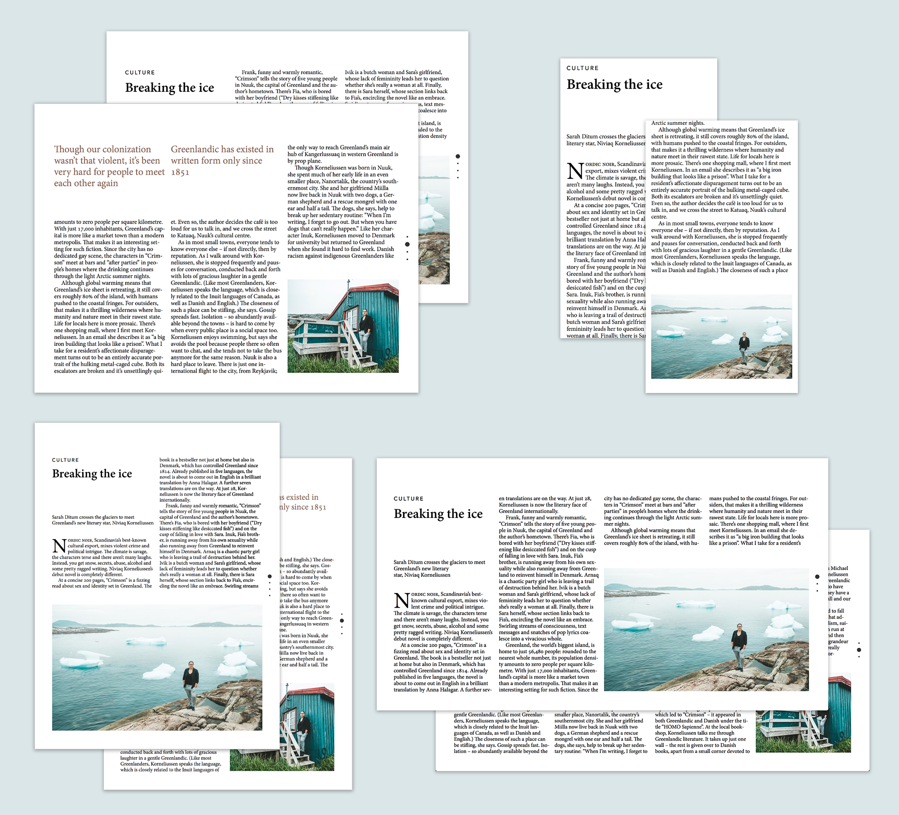

Is it possible to create responsive multi-column layouts?
=========================================================

***This was a personal research project created by Jon Tingvold in 2015 and updated in 2016, 2018 and 2019. The aim was to create a prototype of a responsive multi-column layout and see if the technology was production-ready.***

Demo
----

https://jontingvold.github.io/responsive-multicolumn-layout/

Abstract
--------

Multi-columns are a distinct part of every newspaper. However, on the web, where multi-columns could have helped fill desktop's wide screens, they have so far been absent. While there have been multiple efforts to get proper multi-column support in CSS, today's implementation is flawed. Multi-column javascript libraries have their own challenges: FTColumnflow, the best, is complex and lack responsive layouts. This study, and the included proof-of-concept, shows that it is probably possible to solve these problems and use multi-column layouts in production. After the first version in 2015 browsers have become faster and CSS Scroll Snap has improved the user experience considerably. However, multi-columns are still risky. The complex layout engines necessary are prone to bugs and changing browser behavior.

Introduction
------------

### Why multi-column layouts?

I like reading print. You can see big parts of the page at once. It is easy to scan pages. You can look at headlines and pictures, and go a bit back and forth, and try to figure out what the page is about, without too much commitment. It is easier to examine the connection between the text and picture, introduction and conclusion. This non-linear reading is also a bit relaxing. It makes you stop reading. And think.

I think one of the reasons print feels so superior to the web, is multi-columns. In today's world where most desktops have wide low screens, website's single-column layouts lead to large empty parts, and just a small part of the document is visible at the same time. The whole experience feels a bit like reading documents through a tiny straw. That is problematic because the less you see of a document at the same time, the more of the article you have to hold in your internal memory. And it gets harder to get a holistic view of the article. 

The other problem is that there are no natural breaks. There are no column breaks or page breaks. Just an endless stream of text pointing downwards. I notice it when I read: I forget to take breaks. I look less on images. And I stop less to think about what I am reading.

I also look less on ads. When I read print, my eyes often wander over the page and sometimes stops at the ad in the corner. When I read on the web, I just want to continue with the article I am reading.

It would have been interesting to research if what I am thinking is true.

My unproved thesis is that multi-columns have the following advantages:

- Scanning is easier
- Are more beautiful and relaxing
- Images and headlines get more attention
- Articles are generally communicated better
- Ads get more attention

But if multi-columns are so good, why aren't web designers using it?

### Doesn't CSS have support for multi-columns? 

Multi-columns was proposed as a web standard as early as 1999 ([W3C](https://www.w3.org/TR/css-multicol-1/)) and have been supported by browsers since at least 2005 ([caniuse.com](https://caniuse.com/#search=column-width)). 

However, this standard misses so many vital features that it essentially is useless. The problems are many, but the most important are that:

- It does not support pagination (except for print). So if you have longer text pieces than one screen size, you either have to get very long pages, where the user have to scroll back and worth. Or, you can expand the page vertically, which is problematic because many users lack mouses with support for vertical scrolling.
- `column-span` is still not supported by Firefox ([caniuse.com](https://caniuse.com/#search=column-span)), so images, tables, and other fixed elements can't be larger than the column width.
- There are no controls to float/bound images to the bottom of a column, the last column (on a page) or the page corner

I guess part of the reason multi-column have not seen more traction is that is difficult to implement. It also joins a long list of missing design features in HTML/CSS, so it might also be because W3C and browser makers consist mostly of engineers, and not designers, and are concerned about improving the web as a programming platform, than a document standard.

Without native support, the only way to make multi-column layouts is to create a layout engine in javascript, calculate where each paragraph and image should be displayed, and use absolute positioning. That requires lots of engineering.

Implementation and technical challenges
---------------------------------------

The project is built on [FTColumnflow](https://github.com/ftlabs/ftcolumnflow), a library for creating multi-column layout build by George Crawford for the Financial Times (FT). In many years it was used in Financial times' and The Economist's iPad web apps, back in the days when companies created web apps to avoid Apple's 30 percent revenue cut. And, as far as I know, no other multi-column libraries come close to being as good as it.

### FTColumnflow's design

FTColumnflow is based on fixed page size, you have to specify when FTColumnflow renders the page. The library also differs between two types of content: `fixed` content, like images, that are assigned a specific page and column, and `flowed` content, like the rest of the article, that are flowed (automatically) around the fixed content to fill the pages and columns. Fixed content can be positioned using CSS classes to specify a page number, vertical/horizontal anchoring, column span, and span direction.

FTColumnflow renders first fixed elements, like images, to determine their size. It then sets up the pages using absolute positioning and calculates where the fixed content inside a page should be places and positions it—also with absolute positioning.  Finally, it calculates how large each column can be and fills the columns with content. 

Filling the pages with flowed content is the most complex process. Most javascript libraries that have tried to implement multi-columns, fill each column with elements and paragraphs until a word is placed outside the page. They then cut the paragraph in half, creates a new `p`-element with the remaining text and places it inside the next column. New elements are then placed in the next column until a paragraph, or other text element, overflows the page again.

FTColumnflow found the last operation, of splitting the text, so slow that it became a performance problem. Instead, they found it was less expensive to just hide the excess paragraph behind `overflow: hidden`, calculate the pixel height of the visible paragraph part, and create a new copy of the whole paragraph that could be placed in the next column. If 50 pixel-heights of the paragraph was visible on the previous column, the new paragraph element was offset with `top: 50px`, so the paragraph seemed to flow consistently from one column to the next. 

FTColumnflow's new method is faster, but it creates its own problems. If the page height is not a multiple of the line-height, a part of the excess paragraph line will become visible. The same problem happens if not all lines have the same line-height or a multiple of it. All headers, leads, paragraphs, images, captions, and the page itself, must, therefore, have a height that is a multiple of the standard line-height, even if the elements have different font-sizes. That requires careful configuration of the CSS file. FTColumnflow tries to automatically correct for this, but this feature sometimes fails.

### FTColumnflow's two problems

There are two major problems with the way FTColumnflow is designed.

Few content management systems (CMS) can be configured so it is possible to specify which page and columns images should be placed on. Some CMS systems allow you to set custom classes on images, so you might set up many configuration classes, like one for each page, one for each possible column, one per columns the image can span, and for different floats, but this quickly becomes a mess, and is far from user-friendly.

The other big problem is that is FTColumnflow is based on a fixed page size and does not support responsive layouts. While you can query the browsers viewport size and set FTColumnflow's page size to the same size as the browser window, it creates other problems. Since some screen sizes generate six pages—some only two, and some screens can hold up to four images—some only one, it is hard to know which page images should be placed on, without getting cramped pages with overlapping pictures on some screens. Or getting large empty pages on others, because the text only fills three pages, while you specified that the image should be placed on page 5.

### Making FTColumnflow responsive

To solve, or at least limit, the responsive layout problem, I tried to limit the maximum and minimal screen area of each page.

In the demoed version I wrote some javascript code that sets the maximum page width to 1300 pixels, and the minimum page width to the width of the screen. Then I defined a maximal and minimum screen areal. If the screen size is less than the min areal, the page scroll snap is turned off and the page height is set bigger than the screen height, and so tall that the height and width have an area equal to the min areal. If the screen size is larger than the max areal, the page scroll snap is also turned off, and the page height is set smaller than the screen height and so short, that the height and width (or 1300 px) have an area equal to the max areal. This reduces the chance that images will cramp together, or that there is not enough text to fill all the pages that images have been placed on.

This is by far an ideal solution but avoids the problem enough, as long as you are a bit careful with how you position images.

The ideal solution would have been to rewrite FTColumnflow so it can handle normal HTML documents where images are placed in the middle of the content without special formatting or extensive class names, except some predefined image sizes. Large images could then span two columns, and small images only one. 

The images could then be positioned so that the first image always appeared on the first page in the lower right. Then some predefined areas could be defined, e.g. top right and bottom left. The layout engine could then calculate how large each image would be and make sure that there were never so many images on each page that it would overlap. Then it could try to place the images evenly across the pages, and as close as possible to the text where they were defined. As long as the images are only very loosely bound to the text they appeared along, this would not be too difficult to calculate.

Such a solution would require considerable coding efforts, but it seems possible without major complications.

Findings
----------

### The good

As the proof-of-concept shows, it is possible to create fairly good multi-column layouts today. They can be beautiful, work quite smoothly, and work pretty well on most screen sizes. 

Since 2015, when I made the first version, swiping between pages have become a lot slicker. Back in 2015, I had to use fullPage.js to swipe between pages. The old javascript page swiper libraries animated the page flip after registering a full swipe. Thus, they reacted a bit late. In addition, they did not adjust the animation time to how fast users where swiping. The result was a second class user experience. After most browsers implemented CSS Scroll Snap, swiping is now smooth and multi-column have become a first-class layout experience.

### The bad

The layout engine is a bit slow. It takes 1000 ms to render a page—2000 ms if the page is long. This issue is complicated by the fact that Chrome does not use bfcache (back-and-forward cache) on pages with javascript that manipulate the DOM; the whole page needs to be re-rendered if a user clicks on a link and return back to the page. However, the rendering speed have improve noticeably since 2015 as browsers just-in-time compilers have become ever faster. The Chrome problem is common among web pages, and the page load time is still faster than many news sites. Ideally, I think it too slow, but since the rest of the web community think it's an acceptable rendering time, I guess it is ok.

### The potentially problematic

There are some potentially problematic sides under the hood

The FTColumnflow requirement that all element heights have to be a multiple of the line-height, makes it prone to bugs. It demands a lot from designers, especially when you expect FTColumnflow to correct for it. Small inconsistencies between browsers, like how heigh elements are rendered, can have dramatic consequences. Occasionally, I have seen FTColumnflow jump over a line on column breaks. I suspect this an artifact of overflow, and how FTColumnflow handles column and page breaks. 

The complex layout can sometimes be problematic. In Safari the graphic card sometimes flickers the screen on page swipes; it seems it can't handle the complex layout. Generally, I have also seen more a lot more strange behavior and inconstancies between browsers, than in normal projects. Sometimes it feels like I am pushing the limits of browser technology a bit too much.

None of these problems seems unfixable, but they indicate that multi-columns can be a bit risky to implement.

Conclusion
----------

So is it possible to create responsive multi-column layouts?

The proof-of-concept shows that it at least can be done.

The biggest problems in my solution, such as that FTColumnflow is incompatible with most CMS systems, or that the responsive design is not perfect, can probably be solved, although it requires some engineering.

The worrisome news is that the complicated layout and inconsistencies between browsers are more prone to bugs. It's not discouraging levels, but it makes it risky to use multi-columns, and you have to live with the fact that they probably need extra maintenance.

Code quality
------------

As this project is mostly a research project, the code is not the most readable and has some minor bugs and major design problems. You are welcome to use it, but I would not have used it for production without improving it.

Questions?
----------

Feel free to [send me an email](http://www.jontingvold.no/) if you have questions about the project.